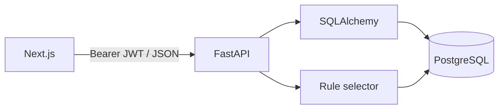
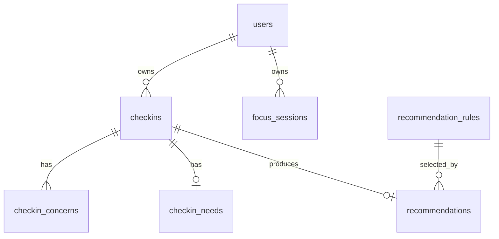

# EXMELLO backend architecture and schema

## Decisions

The current Next.js app is guest first and stores guest activity in browser `localStorage`. This backend adds persistent accounts without changing that flow. Authenticated check-ins, recommendations, focus sessions, and dashboard data belong to the JWT user. Resources are public. Anonymous API writes are deliberately unavailable because there is no stable server side guest identity to enforce ownership.

The API prefix is `/api`, matching the newer backend request. The older PRD's `/api/v1`, single `concern`, and completed-on-create focus contract are superseded by the current frontend's multiple concerns and the newer backend requirements. This repository does not yet call the API from the frontend; integrating it requires a later frontend change.

## Data model

| Table | Main fields and constraints |
| --- | --- |
| `users` | UUID PK, unique indexed email, Argon2 password hash, name, timestamps |
| `checkins` | UUID PK, `user_id` FK cascade, constrained mood, `created_at` |
| `checkin_concerns` | UUID PK, `checkin_id` FK cascade, constrained concern, position 0–2, unique concern and position per check-in |
| `checkin_needs` | UUID PK, `checkin_id` FK cascade and unique, constrained need; at most one optional need for the current UI |
| `recommendation_rules` | String PK, target type/value, priority, active flag, JSON recommendation payload, timestamps and lookup index |
| `recommendations` | UUID PK, unique `checkin_id` FK cascade, nullable rule FK, JSON snapshot and `created_at` |
| `focus_sessions` | UUID PK, `user_id` FK cascade, 1–180 minutes, focus type, constrained status, start/completion/update timestamps and user/time index |
| `resources` | Slug PK, title, summary, category, markdown, UI metadata, publication flag, timestamps and category/publication indexes |

The initial schema is in `alembic/versions/`. PostgreSQL enforces foreign keys and check constraints. All app queries use SQLAlchemy parameter binding. Resource articles and default recommendation rules are seeded once into the database; modifying a rule's database row changes later recommendations without code changes. Each generated recommendation keeps a snapshot so historical check-ins stay stable after edits to rules.

## Recommendation selection

One primary recommendation is selected for each check-in:

1. Explicit need, if present.
2. Matching concern rule with the lowest numeric priority (ties by rule ID). The supplied concerns are all retained.
3. Mood rule.
4. Fallback rule.

The seeded concern order follows the current frontend implementation. Seed rows are starter content; the database is the runtime source of truth. All action paths are Next.js routes already present in the UI.

## Focus lifecycle

`POST /api/focus-sessions` creates `in_progress` with `completed_at = NULL`. `PATCH` can move it once to `completed` after its server side duration has elapsed, or to `cancelled` at any time. Terminal sessions cannot transition again. The client should call the completion PATCH only when its countdown reaches zero. A paused timer may take longer than the nominal duration; the server's minimum elapsed time does not replace the client's timer state.

## Security boundary

Passwords are hashed with Argon2. JWTs use an environment supplied signing secret and expire after the configured period. Ownership filters apply to every user record lookup, including direct IDs. A missing or invalid token returns 401; another user's record returns 404. No browser token storage has been added because the frontend was left untouched.

`DELETE /api/auth/me` removes the account and its owned check-ins, recommendations, and focus sessions. The current frontend's local purge action does not call this endpoint.
